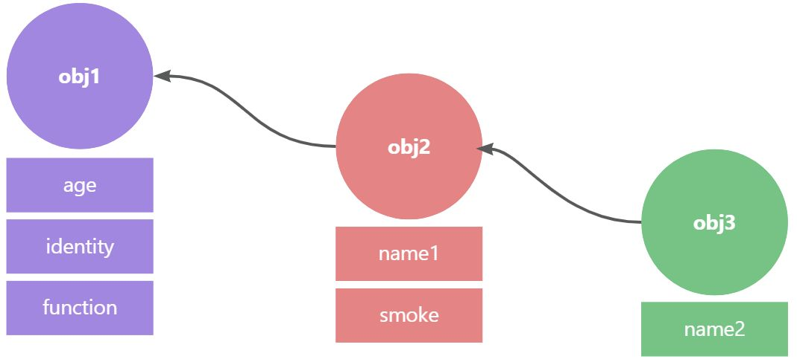
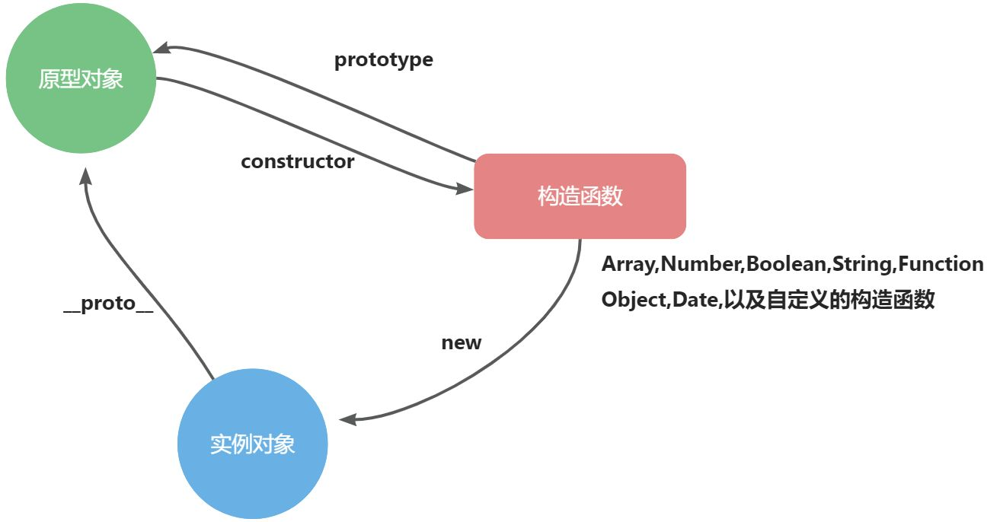
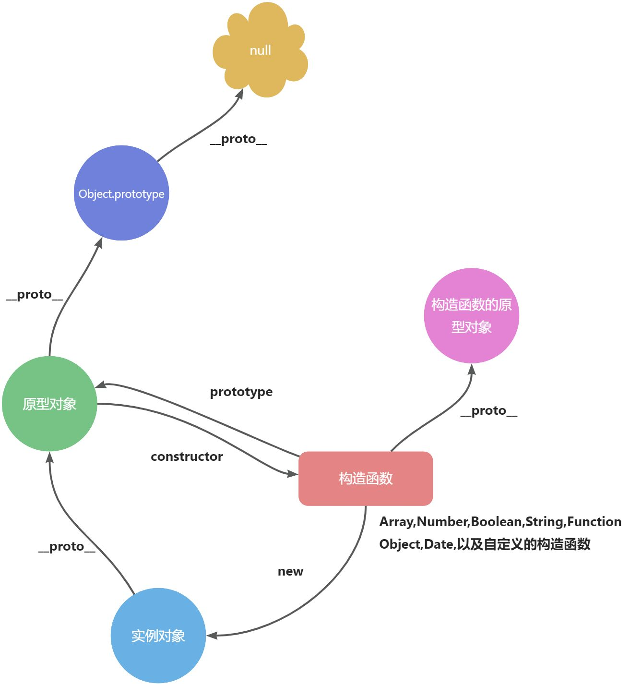
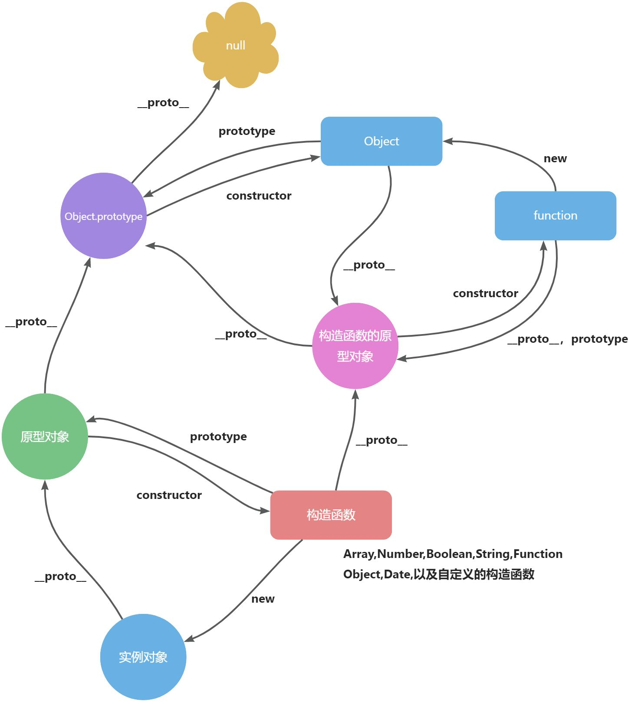

### 1，原型和原型链介绍

> 在设计 JavaScript 语言的时候，借鉴了 self 和 smalltalk 这两门基于原型的语言

**JavaScript 是一门基于原型语言，对象的产生是通过原型对象而来**

之所以选择基于原型的面向对象的系统，是因为一开始开发的时候[布兰登·艾奇（Brendan Eich）](https://baike.baidu.com/item/%E5%B8%83%E5%85%B0%E7%99%BB%C2%B7%E8%89%BE%E5%A5%87/58101949?fromtitle=Brendan%20Eich&fromid=561441&fr=aladdin)没有打算在 JavaScript 这门语言当中加入类的概念，因为 JavaScript 的初衷就是为非专业的开发人员提供一个方便的工具，所以在开发 JavaScript 的时候也是尽可能的简单，易学

### 2，初始原型链，原型

ES5 中提供了一个方法可以用来克隆对象

```javascript
 const obj1 = {
    age: 18,
    identity:"student",
   	smoke() {
      console.log("I like smoke")
    }
const obj2 = Object.create(obj1);
console.log(obj1.age);  // 18
console.log(obj2.age);  // 18
console.log(obj2.__proto__ === obj1 ) // true;
```

在这个示例中我们创建了一个名为 obj1 的对象，通过 Object.create 的方法进行克隆出 obj2， 所以这个时候 obj1 就是 obj2 的原型对象， obj1 上的方法和属性，obj2 上都有且可以使用

```javascript
 const obj1 = {
        age: 18,
        identity:"student"
      }
const obj2 = Object.create(obj1,{
        name1: {
            value:'obj2',
            enumerable:true,
        },
        smoke{
            value:'',
            enumerable:true,
        });

const obj3 = Object.create(obj2,{
          name2: {
              value:'obj3',
              enumerable:true,
              }
          });
console.log(obj3.age);  // 18
console.log(obj3.name1);  // obj2
console.log(obj3.name2);  // obj3
console.log(obj2.__proto__ === obj1 ) // true;
console.log(obj3.__proto__ === obj2 ) // true
console.log(obj3)  // {name:'obj3'}

```

##### 总结

现在我们又通过 Object.create 的方法进行克隆出 obj3，这个 obj3 上有自己本身的属性，也有 obj2 和 obj1 的属性，

当查找一个对象的属性的时候，如果该对象上没有这个属性，则会去该对象上面的原型对象进行查找，如果原型对象上还没有，那么会去找这个原型对象上的原型对象进行查找，他们统一都通过一种链条式的关系连接了起来，这就是**原型链 **



这就是 JavaScript 里面最原始的创建对象的方式，新的对象是通过克隆另外一个对象得到的，被克隆的对象就是新对象的对象原型

### 3，通过构造函数深挖原型关系

但是这种创造的方式还是太过于麻烦，于是借鉴于 java, C#等面向对象的语言开发者开发了构造函数来进行批量的生成对象

```javascript
function People(name, age, sex) {
  this.name = name;
  this.age = age;
  this.sex = sex;
}

People.prototype.smoke = function () {
  console.log(this.name + "喜欢抽烟");
};

let zhangsan = new People("张三", 18, "男");
let lisi = new People("李四", 28, "男");
```

> 虽然这种方式可以批量的进行对象的创建，但是在 js 的底层还是基于原型来创建的对象

通过构造函数传递属性 new 了两个对象，分别放在 zhangsan 和 lisi 两个变量中，但是 People 构造函数构造实例方法时却是挂载在了 People.prototype，这个**prototype**是什么呢？为什么要放到**prototype**中呢？

> **People.prototype**其实就是 people 的实例的原型对象



其实从上面的图我们也可以得出结论

##### 得出结论

- javaScript 中的每一个对象都有原型，可以通过**proto**进行访问这个对象的原型对象
- 构造函数的 prototype 属性指向的是一个原型对象，这个是构造函数实例化出来的对象的原型对象
- 原型对象的 constructor 属性指的是它的构造函数
- 实例对象上是没有 constructor 的，它是通过**proto**原型对象上的 constructor 获取的

下面的代码就可以验证我们的结论

```javascript
function People(name, age, sex) {
  this.name = name;
  this.age = age;
  this.sex = sex;
}

People.prototype.smoke = function () {
  console.log(this.name + "喜欢抽烟");
};

let zhangsan = new People("张三", 18, "男");
let lisi = new People("李四", 28, "男");
console.log(zhangsan.__proto__ === People.prototype); //true
console.log(zhangsan.constructor === People); //true
console.log(People.__proto__ === Array.__proto__); //true
```

内置的构造函数也是如此

```javascript
let arr = []; // 相等于 let arr = new Array()
let obj = {}; // 相等于 let arr = new Object()
console.log(Array.prototype === arr.__proto__); // true
console.log(Object.prototype === obj.__proto__); // true
console.log(People.__proto__ === Array.__proto__); //true
console.log(People.__proto__ === Object.__proto__); //true
```

上面的代码无论是内置的还是自定义的构造函数他们的原型对象都是同一个对象

那么我们继续往下就能整理出这样的一幅关系图



> 原型对象的终点是 null

```javascript
console.log(Array.__proto__.__proto__.__proto__); // null
console.log(Object.__proto__.__proto__.__proto__); // null
```

### 4，原型关系的完整形态

那么既然都说了原型的终点是 null，为什么构造函数的原型对象没有指向了呢？它也是对象呀，这是因为这幅图还不是完整的，构造函数的原型对象还有着指向



最终完整的原型和原型链的一个关联关系就如同上图所属，只需要理解了这个图，那么原型和原型链的关系你就算彻底明白了

```javascript
function People() {}

console.log(
  People.__proto__.__proto__.constructor.__proto__ === People.__proto__
); // true
console.log(People.__proto__.constructor.__proto__ === People.__proto__); // true
```
